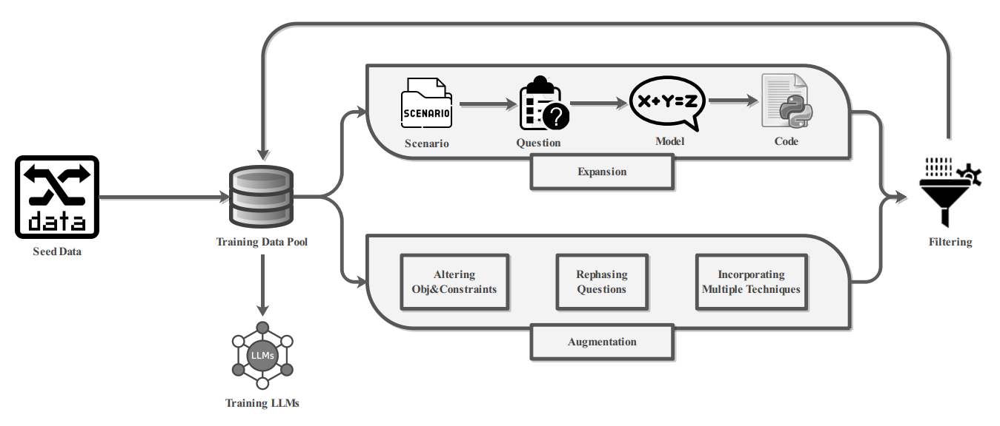

# ORLM: Training Large Language Models for Optimization Modeling

<p align="center" width="100%">
<a ></a>
</p> 

This project explores training open-source LLMs for optimization modeling. We identify four critical requirements for the training dataset of OR LLMs, design and implement OR-Instruct, a semi-automated process for creating synthetic data tailored to specific requirements. We also introduce the IndustryOR benchmark, the first industrial benchmark for testing LLMs on solving real-world OR problems. We apply the data from OR-Instruct to various open-source LLMs of 7b size (termed as ORLMs), resulting in a significantly improved capability for optimization modeling. [Read our paper here](https://arxiv.org/abs/2405.17743).

## News
- 🔥 Thrilled to annouce that ORLM has been accepted by Operations Research.
- 🔥 We continuously update and maintain the IndustryOR Benchmark. If you have any questions or feedback, feel free to contact us! [Check it out](https://huggingface.co/datasets/CardinalOperations/IndustryOR).
- 🔥 We're excited to offer an [Interactive DEMO](https://huggingface.co/spaces/tangzhy/ORLM) of the ORLM-LLaMA-3-8B model, thanks to donations of NVIDIA-A100 from [Huggingface ZeroGPU](https://huggingface.co/zero-gpu-explorers).
- 🔥 We released a sample of the OR-Instruct Data for training LLMs! [View it here](https://huggingface.co/datasets/CardinalOperations/OR-Instruct-Data-3K).
- 🔥 Our [**ORLM-LLaMA-3-8B**](https://huggingface.co/CardinalOperations/ORLM-LLaMA-3-8B) model achieves SOTA on the [NL4OPT](https://huggingface.co/datasets/CardinalOperations/NL4OPT), [MAMO](https://huggingface.co/datasets/CardinalOperations/MAMO), and [IndustryOR](https://huggingface.co/datasets/CardinalOperations/IndustryOR) benchmarks!
- 🔥 We launched the IndustryOR benchmark, the first industrial benchmark, consists of 100 real-world OR problems! [Check it out](https://huggingface.co/datasets/CardinalOperations/IndustryOR).


| Model             | Checkpoint | License | NL4OPT | MAMO EasyLP | MAMO ComplexLP | IndustryOR | Micro Avg | Macro Avg |
|-------------------|------------|---------|--------|-------------|----------------|------------|-----------|-----------|
| ORLM-LLaMA-3-8B   | 🤗 <a href="https://huggingface.co/CardinalOperations/ORLM-LLaMA-3-8B" target="_blank">HF Link</a> | <a href="https://llama.meta.com/llama3/license/" target="_blank">llama3</a> | 85.7% | 82.3% | 37.4% | 38.0% | 71.4% | 60.8% |

                                                                                               

## Performances

Below is the comparison of performance on the NL4OPT, MAMO, and IndustryOR benchmarks. Values marked with a <sup>*</sup> are directly copied from original papers, with blanks where data were not reported. The highest results are highlighted in bold.

| **Method**                                     | **NL4OPT**              | **MAMO EasyLP**       | **MAMO ComplexLP**  | **IndustryOR**    | **Micro Avg**   | **Macro Avg**   |
|------------------------------------------------|-------------------------|-----------------------|----------------------|-------------------|-----------------|-----------------|
| *Methods based on PLMs*                        |                         |                       |                      |                   |                 |                 |
| `tag-BART`                                     | 47.9%<sup>*</sup>               | -                     | -                    | -                 | -               | -               |
| *Methods based on GPT-3.5*                     |                         |                       |                      |                   |                 |                 |
| `Standard`                                     | 42.4%<sup>*</sup>                | -                     | -                    | -                 | -               | -               |
| `Reflexion`                                    | 50.7%<sup>*</sup>                | -                     | -                    | -                 | -               | -               |
| `Chain-of-Experts`                             | 58.9%<sup>*</sup>                | -                     | -                    | -                 | -               | -               |
| *Methods based on GPT-4*                       |                         |                       |                      |                   |                 |                 |
| `Standard`                                     | 47.3%<sup>*</sup>                | 66.5%<sup>*</sup>              | 14.6%<sup>*</sup>             | 28.0%             | 50.2%           | 39.1%           |
| `Reflexion`                                    | 53.0%<sup>*</sup>                | -                     | -                    | -                 | -               | -               |
| `Chain-of-Experts`                             | 64.2%<sup>*</sup>                | -                     | -                    | -                 | -               | -               |
| `OptiMUS`                                      | 78.8%<sup>*</sup>                | -                     | -                    | -                 | -               | -               |
| *ORLMs based on open-source LLMs*              |                         |                       |                      |                   |                 |                 |
| `ORLM-Mistral-7B`                              | 84.4%                   | 81.4%                 | 32.0%                | 27.0%             | 68.8%           | 56.2%           |
| `ORLM-Deepseek-Math-7B-Base`                   | **86.5%**               | 82.2%                 | **37.9%**            | 33.0%             | 71.2%           | 59.9%           |
| `ORLM-LLaMA-3-8B`                              | 85.7%                   | **82.3%**             | 37.4%                | **38.0%**         | **71.4%**       | **60.8%**       |

## Setup

To get started, clone ORLM and install the required packages:

```bash
git clone https://github.com/Cardinal-Operations/ORLM.git
cd ORLM
pip install -r requirements.txt
```

## Inference

Prompting Template:
```text
Below is an operations research question. Build a mathematical model and corresponding python code using `coptpy` that appropriately addresses the question.

# Question:
{Question}

# Response:
```

Please replace the `{Question}` with any natural language OR question.

To run a sample inference, use this command:

```bash
cd ORLM
python scripts/inference.py --model_name_or_path <path_to_local_orlm_directory> --tensor_parallel_size <num_gpus>
```

## Evaluation

First, we prompt the ORLMs to generate a complete solution that includes both a mathematical model and a program (refer to `eval/generate.py`). We then extract this program and run it to obtain the predicted optimal value using parallel processing (see `eval/execute.py`, currently supporting only the COPT solver). We evaluate the accuracy by comparing the execution results with the ground truth optimal value. 

Note that variations in results may occur due to differences in computing resources, as executions are performed in parallel. Additionally, for hard examples like IndustryOR, where the number of variables may increase significantly, consider applying for [COPT web licenses](https://copt.shanshu.ai/license/home). Otherwise, execution may directly fail.

Here's how to evaluate the ORLM models on various benchmarks:

```bash
# (Optional) If you have trouble accessing the Hugging Face website, you can set an alternative endpoint:
# export HF_ENDPOINT=https://hf-mirror.com
cd ORLM
sh scripts/eval.all.sh <path_to_local_orlm_directory> <number_of_gpus>
```

We also provide detailed completions and execution results in the `results` directory for the ORLM-LLaMA-3-8B model on the above benchmarks.

## Training

We also provide a training recipe that fine-tunes ORLM models using DeepSpeed and multi-GPU parallelization.

```bash
MODEL_NAME_OR_PATH=<path_to_your_base_model>
DATA_PATH=<path_to_your_data_file_in_jsonl_format>
SAVE_PATH=<save_model_output>

NUM_GPUS=<num_gpus>
BATCH_SIZE_PER_GPU=1
TOTAL_BATCH_SIZE=<batch_size>
PREPROCESSING_NUM_WORKERS=0
GRADIENT_ACC_STEPS=$(($TOTAL_BATCH_SIZE/$NUM_GPUS/$BATCH_SIZE_PER_GPU))
MAX_SEQ_LENGTH=8192
LEARNING_RATE=<learning_rate>
NUM_TRAIN_EPOCHS=<train_epochs>

torchrun \
    --nproc_per_node $NUM_GPUS \
    -m train.finetune \
    --model_name_or_path $MODEL_NAME_OR_PATH \
    --train_dataset_name_or_path $DATA_PATH \
    --output_dir $SAVE_PATH \
    --per_device_train_batch_size $BATCH_SIZE_PER_GPU \
    --per_device_eval_batch_size $BATCH_SIZE_PER_GPU \
    --gradient_accumulation_steps $GRADIENT_ACC_STEPS \
    --evaluation_strategy "no" \
    --save_strategy "no" \
    --save_total_limit 1 \
    --preprocessing_num_workers $PREPROCESSING_NUM_WORKERS \
    --ddp_timeout 14400 \
    --max_seq_length $MAX_SEQ_LENGTH \
    --learning_rate $LEARNING_RATE \
    --lr_scheduler_type linear \
    --warmup_ratio 0.03 \
    --num_train_epochs $NUM_TRAIN_EPOCHS \
    --logging_steps 1 \
    --report_to "tensorboard" \
    --gradient_checkpointing True \
    --deepspeed train/configs/stage3_no_offloading_bf16.json \
    --overwrite_output_dir \
    --bf16 True
```

## Citation
Please cite the paper if you refer to our model, code, data or paper.

```
@article{huang2024orlm,
  title={ORLM: A Customizable Framework in Training Large Models for Automated Optimization Modeling},
  author={Huang, Chenyu and Tang, Zhengyang and Ge, Dongdong and Hu, Shixi and Jiang, Ruoqing and Wang, Benyou and Wang, Zizhuo and Zheng, Xin},
  journal={arXiv e-prints},
  pages={arXiv--2405},
  year={2024}
}
```
